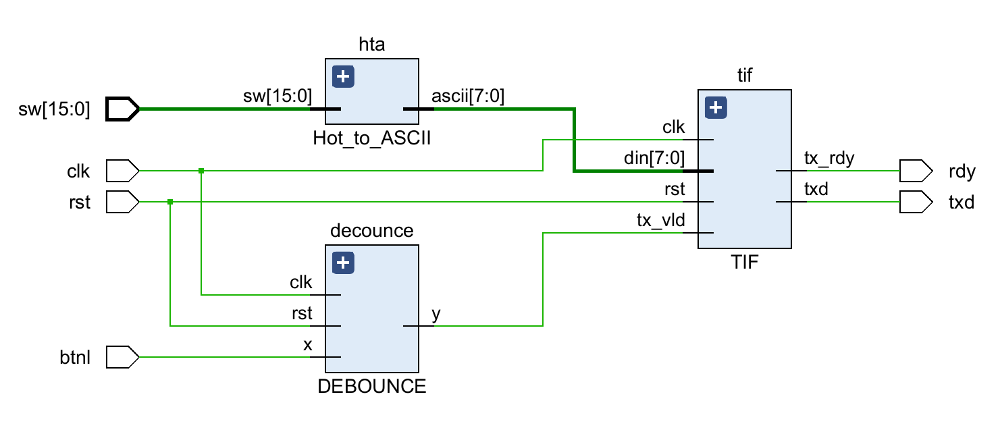
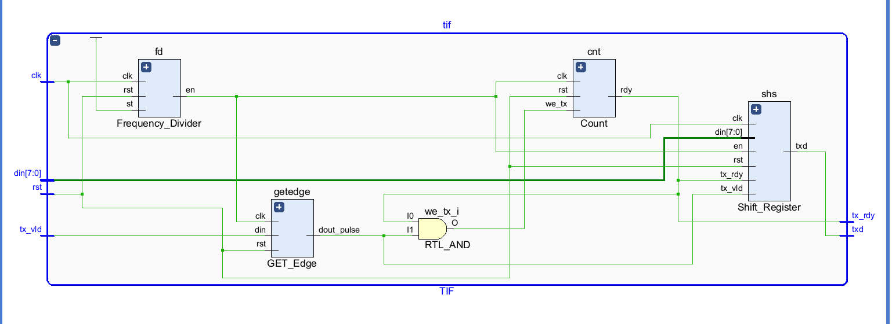
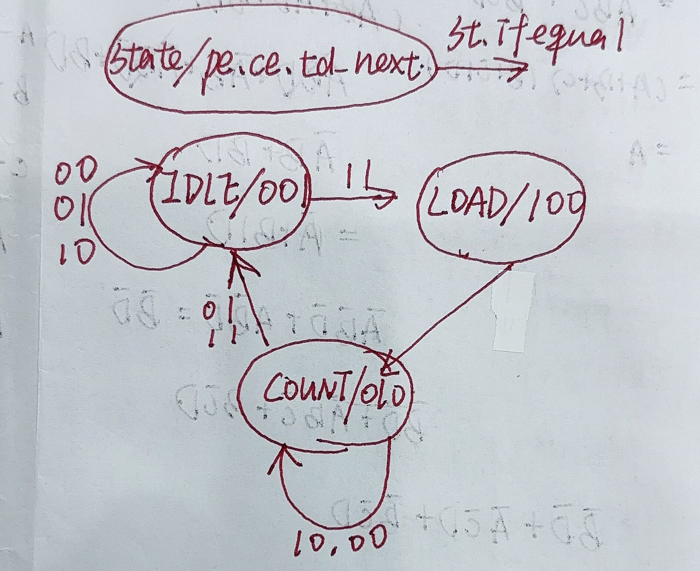
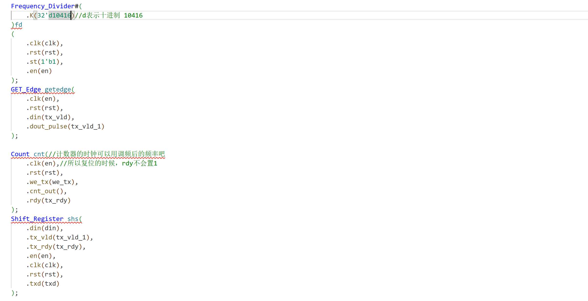
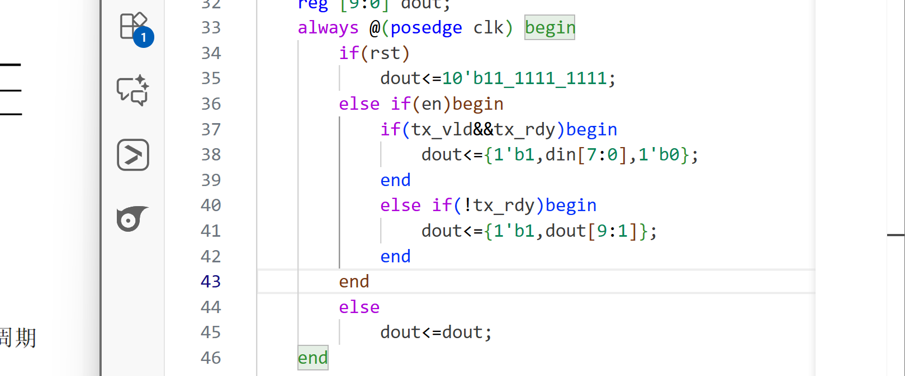
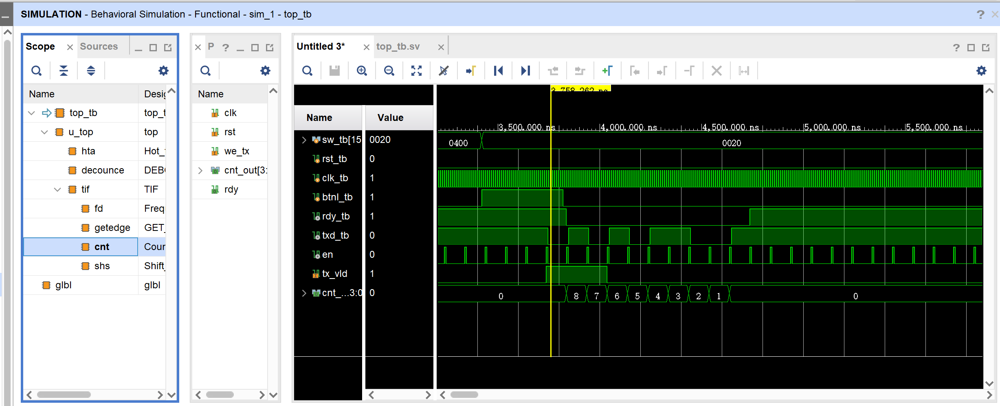
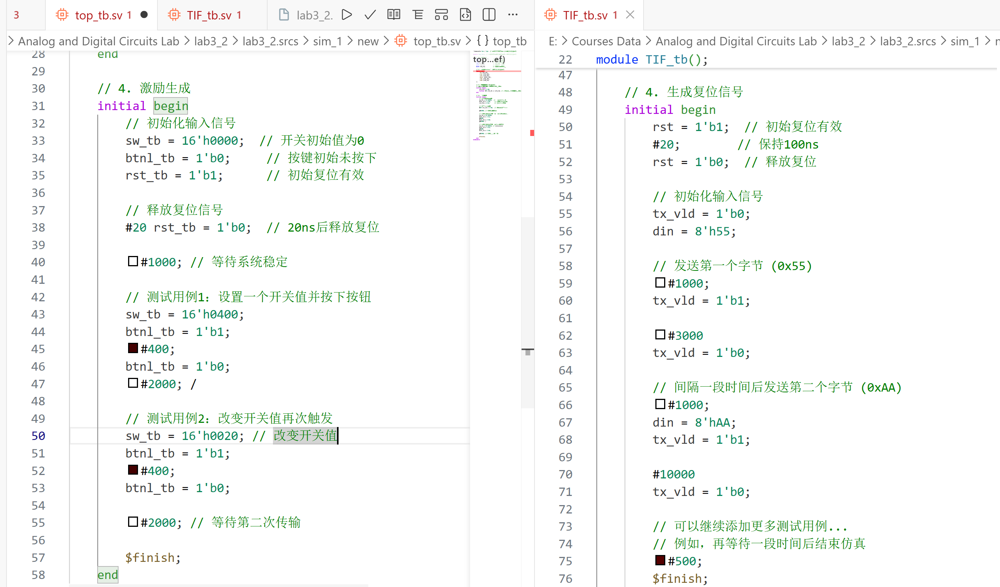
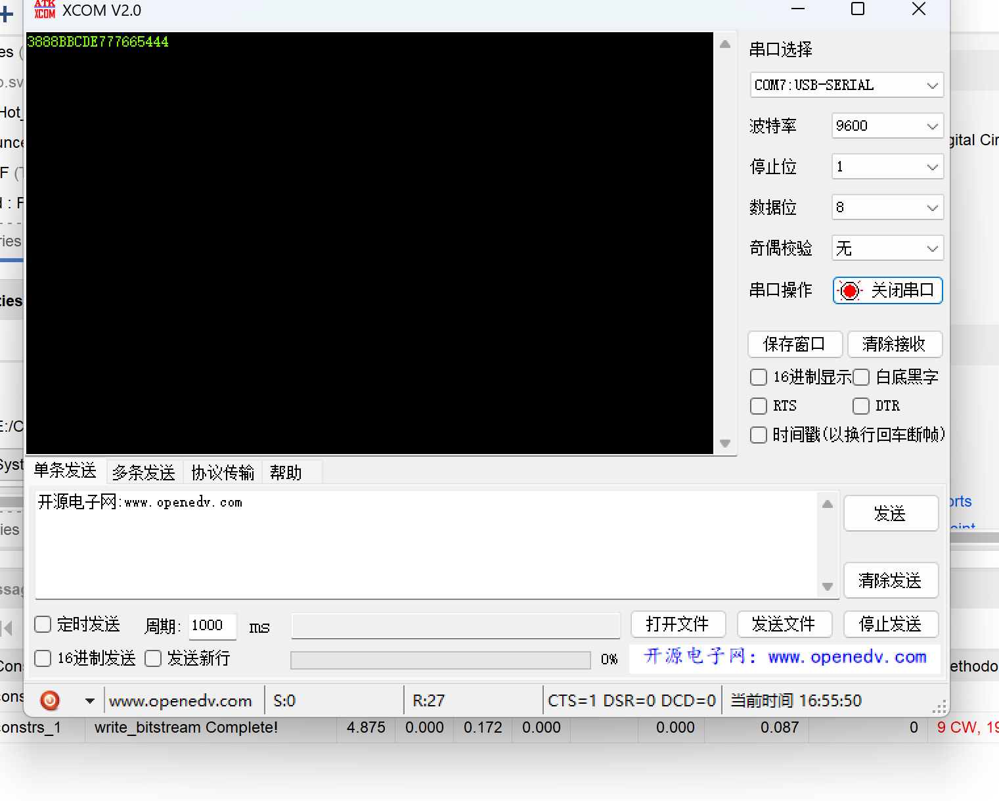

# Lab 3 report

**PB24111630 黄雯佩**

## 一，实验目的与内容

1. 请用自己的语言简述本次实验做的内容以及本次实验的目的，不要照抄实验PPT哦！ 
   开始学着设计时序电路 
   第一周：做一个计数器、调频器、计时器、去抖动、多个七段数码管显示；学会用状态机，或者说状态机的思想 
   第二周：了解串口的基本原理，实现串口输入 
## 二，逻辑设计

1. 请参照PPT画出你设计的各模块的框图和数据通路，可以使用（在线）思维导图类软件进行绘制； 
   第一周：
   

      
   

   

      
   

   第二周：
   

      
   

   

      
   

   (突然发现RTL分析这个，比我手画的清楚明白多了；其实开始做的时候会大概画了几个潦草的框，不适合交也不知道去哪了，再为了报告画一个好费时间，希望助教和老师理解；不行的话再画)
2. 如果存在状态机，请绘制出状态机的状态转换图； 
   第一周：
   

      
   

   第二周：没弄状态机，以后长记性，应该搞一个；状态转换就是分析tx_vld,tx_rdy,count[3:0]这些信号来的
3. 请贴出你认为较为核心的代码以及自己有两点的设计代码，并加以解释说明。 
   第一周：
   

      
   

   

      
   

   

      
   

   三段式状态机，pe&ce两个使能信号两段式输出，td三段式输出，而且在前两段中均是td_next 
   第二周：
   

      
   

   

      
   

    (1)首先分频器产生了9600Hz的占空比1/9600的信号en，并将en作为时钟信号实现取边沿和计数，作为使能信号实现移位寄存器；为了保证时钟信号里面真的是时钟，可以这么用使能信号！ 
    (2)用去抖动+取边沿，实现按一次开关至传输一个8位数据 

## 三，仿真结果与分析

1. 请给出你使用的仿真文件的运行结果截图，并对结果加以阐释；
   第一周：
   

      
   

   timer_tb
   

      
   

   reset_tb
   

      
   

   FSM_tb 
   第二周：
   

      
   

   

      
   

   首先，最最最长教训的一点，仿真的时候一定一定要改去抖动和调频的周期，否则否则就很难绷，今天中文下午研究了好久问题在哪，最后才发现这玩意没改o(╥﹏╥)o
   

      
   

   图中独热码下0020对应0000_0000_0010_0000,8'h35,ascii码001110101，加上起始终止位输出0101011001,输出一次后txd置1，直至下次按下btnl

2. 请贴出你编写的有特点的仿真测试文件，并说明你在编写仿真测试文件时，对各类情况的考虑（选做）。 
   第一周：
   

      
   

   timer_tb：如图五种情况
   

      
   

   reset_tb：测试快速复位 
   第二周：
   

      
   

    学会用$finish了！

## 四，电路设计与分析

1. 请给出完整的RTL电路图。若某模块较为复杂，也可以再给出该模块的RTL电路图； 
   第一周：
   

      
   

   

      
   

   第二周：
   

      
   

   

      
   

   
2. 查看并在此附上资源使用情况，并截图证明WNS为非负数。 
   第一周：
   

      
   

   

      
   

   第二周：
   

      
   

   

      
   

## 五，测试结果与分析

1. 请拍照并附上实验上板结果，以佐证设计的正确性； 
   第一周：
   

      
   

   

      
   

   

      
   

   第二周：
   

      
   

2. 对实验上板结果进行简要的说明。 
    第一周：开关输入数据按下启动按钮后，按1Hz的频率开始倒计时，倒计时结束后led15灯亮 
    第二周：sw设置好独热码后，每按一次btnl，PC端就会输出一个对应字符；如果输入不是独热码，没有输出；

## 总结

1. 请对本次实验中你完成的任务进行简要总结，并总结自己的收获和体验； 
   一堆教训o(╥﹏╥)o。仿真和上板周期可能不一样，记得改；学会用状态机状态机；板子上开关的开闭一定要推到头，否则可能以为关了其实没关o(╥﹏╥)o；回想起上周的实验好费劲，一打开看着那十来个.sv文件就吓了一跳；
2. 如果对本次实验的设计或助教、老师有建议，可以在这里写下，助教和老师会认真阅读并讨论哦！ 
   报告可以不画电路设计图吗