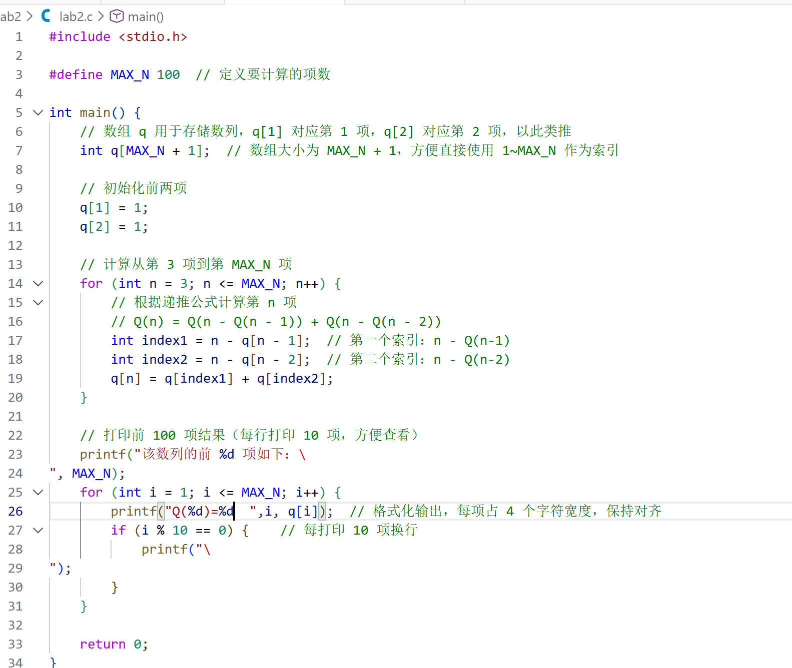
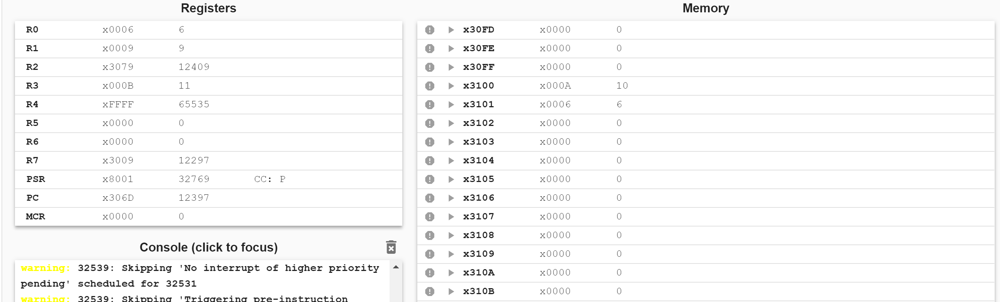
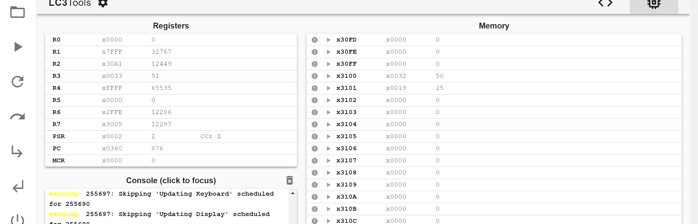
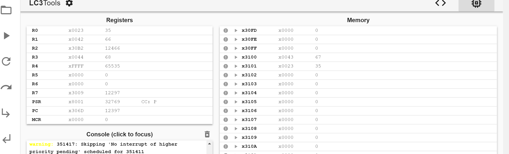
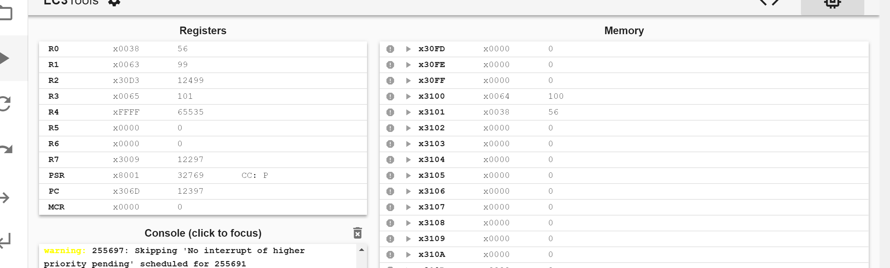

# Lab2: Hofstadter Q 序列实验报告

**姓名：** [黄雯佩]  
**学号：** [PB24111630]  
**日期：** [2025.11.21]

## 1. 解决方案描述

### 1.1 存储方案
使用.BLKW #100指令在内存中分配100个字（word）的连续空间，数组起始标签为Q_ARRAY，对应内存中的固定地址，采用基于0的索引方式：Q[1]存储在Q_ARRAY+0,Q[2]存储在Q_ARRAY+1，以此类推
### 1.2 算法实现
算法按照以下步骤实现： 
(1)**初始化阶段**： 
   从内存地址 x3100 读取输入值 N 
   如果 N ≤ 2，直接返回结果 1 到 x3101 
   初始化 Q[1] = 1，Q[2] = 1 
(2)**循环计算阶段**（i 从 3 到 N）： 
   每次循环后把计算结果存入Q[i] 
(3)**结果输出**： 
   将 Q[N] 的值存储到内存地址 x3101 
   程序终止 
### 1.3 数据访问方式
先通过LEA将Q_ARRAY的地址加载进入R2，后使用STR写入，LDR访问 
## 2. 实验结果
### 2.1 测试用例验证
用C语言程序给出了N=1~100时的Q(n) 

  

  

### 2.2 程序执行截图
N=10 

  

N=50 

  

N=67 

  

N=100 

  

## 3. 挑战与解决方案
### 3.1 内存访问优化
参考参考方法中的优化建议，将最近计算的两个值 Q(n-1) 和 Q(n-2) 保存在寄存器中，减少内存访问次数。 

### 3.2 边界条件处理
当索引值 i-Q(n-1) 或 i-Q(n-2) 小于 1 时，需要处理数组越界问题。在访问 Q[t1] 和 Q[t2] 前添加边界检查，确保索引值在有效范围内。 

### 3.3 寄存器管理
   R0-R1: 用于临时计算和函数参数传递 
   R2：储需Q_ARRAY基地址 
   R3: 循环计数器 i 
   R5-R6: 保存 Q(n-1) 和 Q(n-2) 的值 
## 4.溢出考虑
C语言代码对前一百项的输出证明了没有溢出问题，无需取模运算