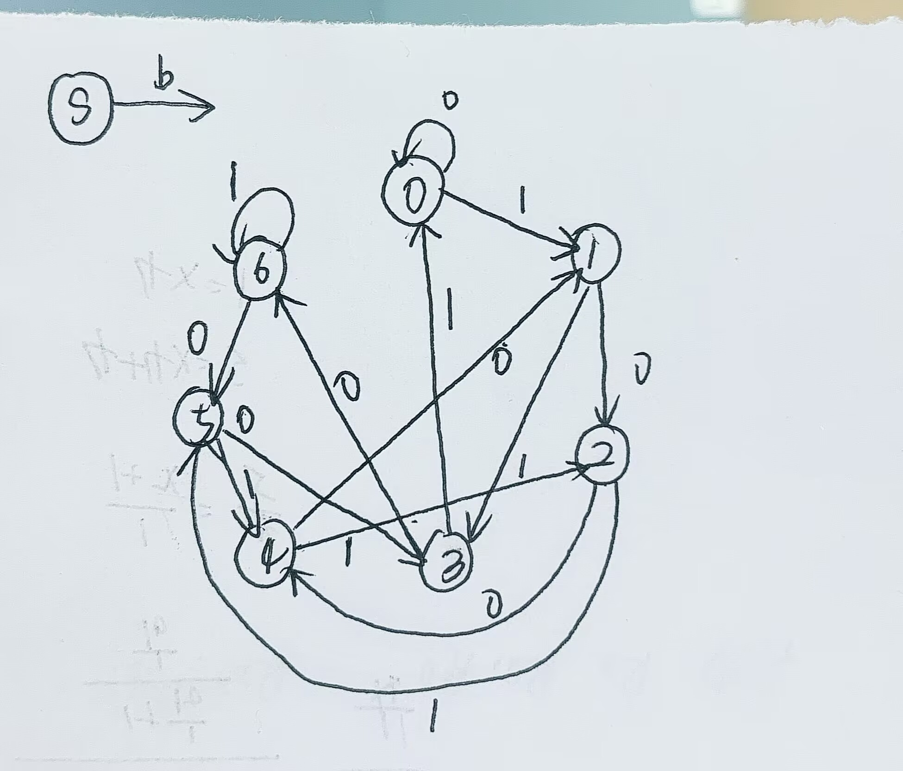
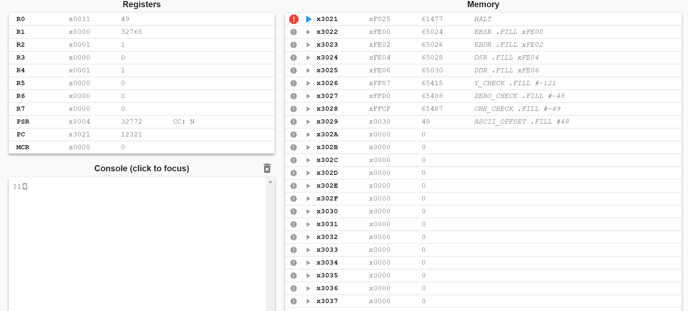
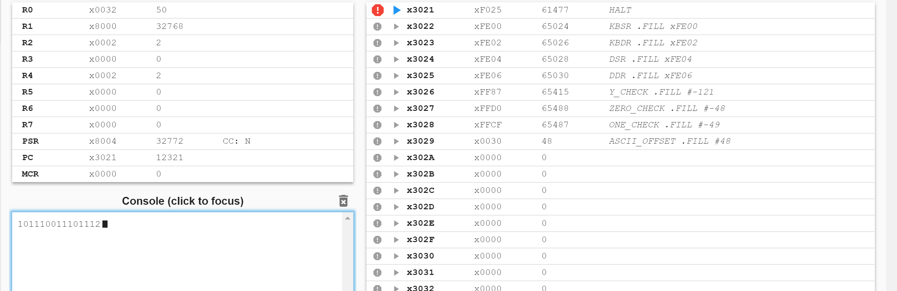
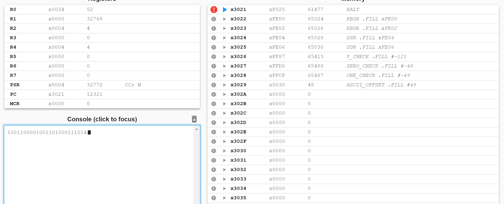
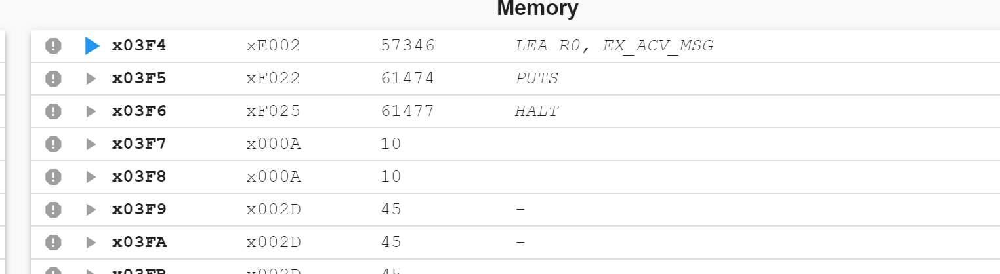

# Lab3: Modulo 7 实验报告

## 学生信息
- **姓名**：黄雯佩
- **学号**：PB24111630

## 1解决方案描述

本实验采用方法B（有限状态机FSM）来实现二进制数的模7运算。该方法的核心思想是利用状态转移来跟踪当前输入值的模7结果，而不是直接计算大数的模运算。

### 1有限状态机设计

FSM包含7个状态（状态0到状态6），分别代表当前已输入二进制串的模7结果。每次输入一个新的二进制位（0或1）时，状态会根据当前状态和输入位进行转移。

**1.1 状态转移规则** 
当前状态为 `S`（S ∈ {0,1,2,3,4,5,6}） 
新输入位为 `b`（b ∈ {0,1}） 
新的数值为：`新值 = 2 × S + b` 
新状态为：`新状态 = (2 × S + b) mod 7` 

**1.2 状态转移表**：

| 当前状态 | 输入0 → 新状态 | 输入1 → 新状态 |
|---------|--------------|--------------|
| 状态0   | (2×0+0)%7=0 | (2×0+1)%7=1 |
| 状态1   | (2×1+0)%7=2 | (2×1+1)%7=3 |
| 状态2   | (2×2+0)%7=4 | (2×2+1)%7=5 |
| 状态3   | (2×3+0)%7=6 | (2×3+1)%7=0 |
| 状态4   | (2×4+0)%7=1 | (2×4+1)%7=2 |
| 状态5   | (2×5+0)%7=3 | (2×5+1)%7=4 |
| 状态6   | (2×6+0)%7=5 | (2×6+1)%7=6 |

**1.3 FSM状态转移图**

  

### 2算法实现流程
**2.1初始化**：设置初始状态为0（空字符串的模7结果为0）   
**2.2输入处理**：循环读取每个字符 
如果输入是'0'：状态转移（新状态 = (2×当前状态+0) mod 7） 
如果输入是'1'：状态转移（新状态 = (2×当前状态+1) mod 7） 
如果输入是'y'：结束输入，进入输出阶段 
**2.3输出结果**：将最终状态转换为ASCII字符并输出 
这意味着我们只需要跟踪当前值的模7结果，而不需要存储整个 
## 3程序输入输出截图
### 3.1测试案例1
**输入**：`1`  
**输出**：`1`  

  

### 3.2测试案例2  
**输入**：`10111001110111`  
**输出**：`2`  

  

### 3.3测试案例3
**输入**：`100110000100110100011101`  
**输出**：`4`  

  

## 4遇到的挑战与解决方案
**4.1**一开始的时候总是无法输入，单步运行到第二条指令就会无故跳转到下图，选择忽略特权模式就好了了

  

**4.2**寄存器分配
R0:存放输入/输出的字符（ASCII 码） 
R1:专用于轮询键盘和显示器的状态寄存器 
R2:存储当前计算的模7结果（0-6） 
R3:在比较输入字符时，存放目标ASCII码的负值：-'y',-'0',-'1' 
R4:状态转移计算时存放临时数据 

