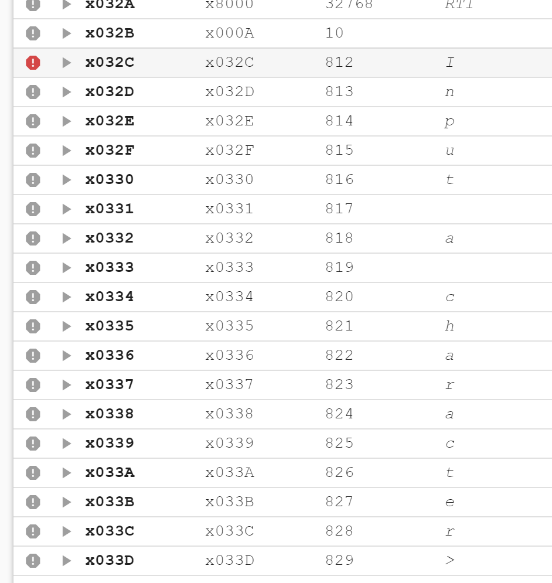
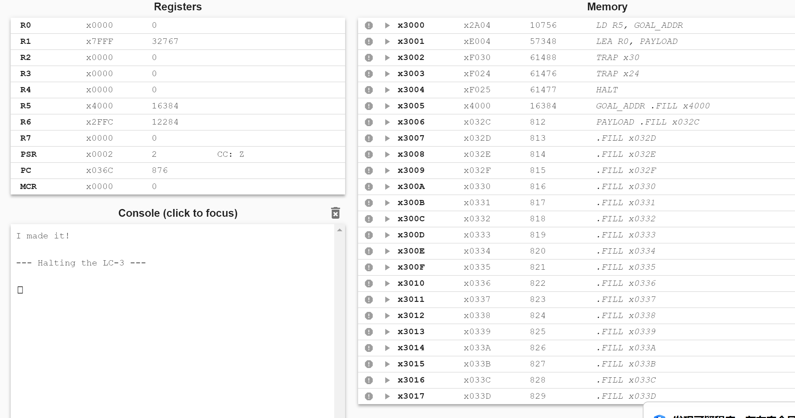

# Lab 5: Break the Barrier 实验报告

## 学生信息
**姓名**：黄雯佩
**学号**：PB24111630

## 1. 实验目的
本实验旨在通过 LC-3 汇编语言模拟缓冲区溢出攻击。
通过利用不安全的字符串拷贝机制，突破用户态限制，在特权模式下运行恶意代码，理解缓冲区溢出原理、特权级管理、中断服务程序劫持。

## 2. 实验过程

### 2.1 攻击逻辑实现步骤
1. **恶意代码部署**：将目标“恶意”程序放置在x4000 地址处，该程序将在特权模式下输出 "I made it!"。
2. **构造 Payload**：
构造一个以 x032C 开始的字符串。
填充前 20 个字（x032C 至 x033F）以填满 IN 指令的提示信息缓冲区。
在第 21 个位置（即 x0340，PUTSP 的入口地址）写入 JMP R5 指令（机器码 xC140）。
3. **触发溢出**：
将恶意程序的入口地址 x4000 加载到 R5。
调用 TRAP x30。该自定义陷阱程序会将 R0 指向的 Payload 拷贝至 x032C，由于未检查长度，会溢出并覆盖 x0340 处的 PUTSP 代码。
1. **执行劫持**：调用 TRAP x24 (PUTSP)。此时系统跳转至 x0340 执行，运行我们注入的 JMP R5，从而跳转到 x4000 以特权模式执行。

### 2.2 遇到的问题和解决办法
**如何启动x0340处的程序** 
观察LC3tools的初始状态发现，x0024处存储了x0340，因此通过TRAP x24进行跳转 

**单步运行后认为 x032C 到 x0341 的值没有改变**  
实际上内存的值已经变了，只是注释没有变。  

  

**执行 TRAP 指令后 R6 寄存器的值改变**  
x0340 处存储 JMP R5，而不是 JMP R6，用 R5 储存 x4000 的地址。  
因为执行 TRAP 指令时，由用户模式切换到特权模式，R6 需要存储栈指针。  

## 3. 实验结果

  

TRAP x30 执行后，JMP R5 成功存储到地址 x0340，TRAP x24 后跳转到 x4000，输出 I made it!